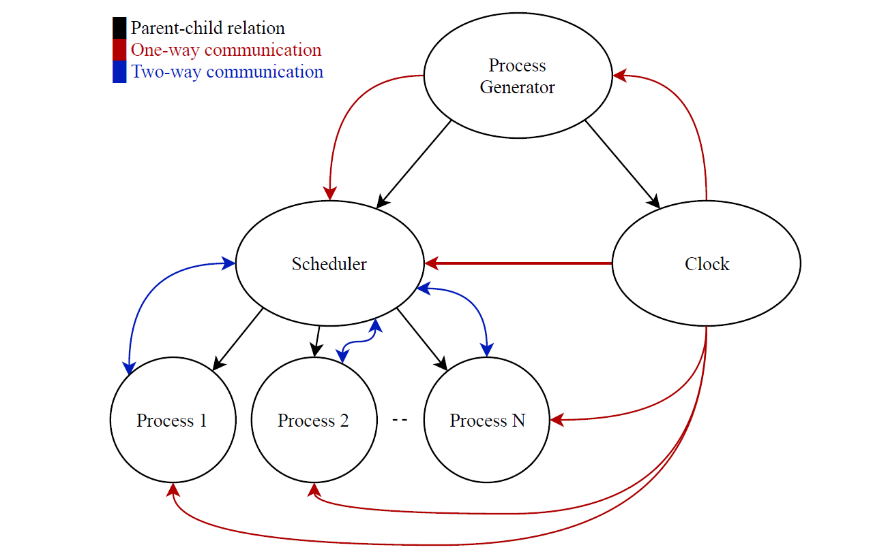
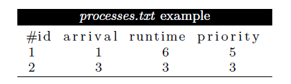
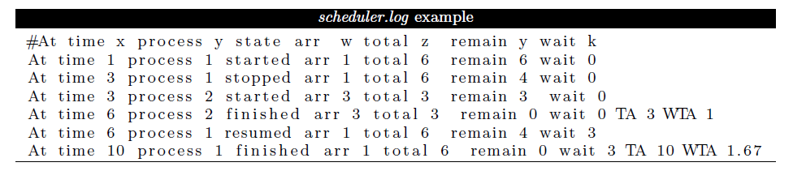
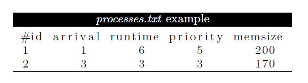
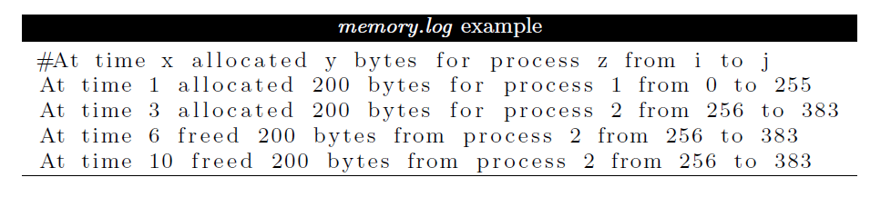

<div align="center">

# OScheduler

</div>

<div align="center">

An Operating systems scheduler

</div>

## Description

-The project is done on two phases

### Phase 1

- A CPU scheduler determines an order for the execution of its scheduled processes.
- Computer with 1-CPU and infnite memory. It is required to make a scheduler with its complementary components as sketched in the following diagrams.
<div align = "center">



</div>

#### Process generator

- Read the processes to schedule from input file
- Ask the user for the chosen scheduling algorithm (and its parameters in case of **Round Robin (RR)** which is the **quantum**)
- Initiate and create the scheduler and clock processes.
- Send process information to the scheduler when it arrives

#### Clock

- The clock module is used to emulate an integer time clock.

#### Scheduler

- It keeps track of the processes and their
  states and it decides - based on the used algorithm - which process will run and for how long.

- Algorithms used: -
  1. Non-preemptive Highest Priority First (HPF).
  2. Shortest Remaining time Next (SRTN).
  3. Round Robin (RR).

#### Process

- Each process should act as if it is CPU-bound.

### Input/Output

- Input File

<div align = "center">



</div>

- Output File
  - Record state of processes : started, resumed, stopped, finished.
  - TA (Turnaround time) & WTA(Weighted turnaround time) are written only at finished state.

<div align = "center">



</div>

- Scheduler.pref
Contains
_ CPU utilization
_ Average turnaround time
_ Average weighted turnaround time
_ Standard deviation of weighted turnaround time
<hr>

### Phase 2

- Scheduler is modified to include memory allocation capabilities using the **buddy memory allocation system**. It should allocate memory space for processes as they enter the system and free it as they leave so that it can be re-used by later processes.
- The total memory size is 1024 bytes.

#### Input file edit

<div align = "center">



</div>

#### Memorylog

<div align = "center">



</div>

## Getting Started

### Dependencies

- Platform: Linux
- Language: C

### Installing

```
git clone https://github.com/Mohamed5828/processScheduler
```

### Executing program

- Direct to the folder of phase1 ot phase2
- Open terminal
- Build project using

```
make
```

- Or build it using

```
make build
```

- Generate test cases

```
./test_generator.out
```

- Enter number of processes to be generated
- Run it using

```
make run
```

- Select algorithm

  1 for Non-preemptive Highest Priority First (HPF).

  2 for Shortest Remaining time Next (SRTN)

  3 for Round Robin (RR).

- In case of round robin enter the quantum

## License

This project is licensed under the [MIT] License - see the [LICENSE.md](LICENSE) file for details
